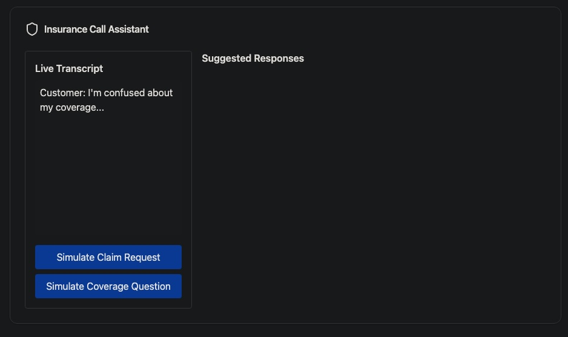

## POC specifically for insurance call centers. Key insurance-specific features include:

1. Compliance and Risk Management:
- Real-time HIPAA compliance alerts
- Legal involvement detection
- Automated documentation requirements

1. Policy Context:
- Instant policy information retrieval
- Coverage verification
- Claims history access
- Renewal tracking

1. Specialized Workflows:
- Claims filing assistance
- Coverage explanation templates
- Step-by-step guidance for different insurance scenarios
- Regulatory compliance checkpoints

1. Integration Opportunities:
- Claims management system
- Policy database
- Risk assessment tools
- Compliance documentation system

insurance-specific enhancements to the call center system:

1. Advanced Features:
- Multi-policy handling
- Premium calculation assistance
- Coverage gap detection
- Risk assessment automation

1. Compliance Enhancement:
- State-specific insurance regulations
- Required disclaimers tracking
- Automated compliance documentation
- License verification

1. Claims Optimization:
- Fraud detection indicators
- Severity assessment
- Claims routing logic
- Settlement estimation

# example page:



```javascript
import React, { useState, useEffect } from 'react';
import { Card, CardHeader, CardTitle, CardContent } from '@/components/ui/card';
import { MessageCircle, AlertCircle, CheckCircle, Shield } from 'lucide-react';

const InsuranceCallAssistant = () => {
  const [transcript, setTranscript] = useState('');
  const [suggestions, setSuggestions] = useState([]);
  const [sentiment, setSentiment] = useState('neutral');
  const [policyContext, setPolicyContext] = useState(null);
  const [complianceAlerts, setComplianceAlerts] = useState([]);
  const [nextSteps, setNextSteps] = useState([]);

  // Simulate policy information retrieval
  const fetchPolicyContext = (policyNumber) => {
    setPolicyContext({
      policyNumber: 'POL-123456',
      type: 'Auto Insurance',
      status: 'Active',
      lastClaim: '2024-01-15',
      coverageLevel: 'Comprehensive',
      renewalDate: '2025-01-01'
    });
  };

  // Simulate real-time transcription and analysis
  const updateTranscript = (newText) => {
    setTranscript(prev => prev + newText);
    analyzeSentiment(newText);
    generateSuggestions(newText);
    checkCompliance(newText);
  };

  // Compliance check simulation
  const checkCompliance = (text) => {
    if (text.toLowerCase().includes('medical') || text.toLowerCase().includes('injury')) {
      setComplianceAlerts(prev => [...prev, 'HIPAA regulations apply - Use secure documentation']);
    }
    if (text.toLowerCase().includes('lawsuit') || text.toLowerCase().includes('attorney')) {
      setComplianceAlerts(prev => [...prev, 'Legal involvement detected - Escalate to supervisor']);
    }
  };

  // Generate context-aware suggestions
  const generateSuggestions = (text) => {
    if (text.toLowerCase().includes('claim')) {
      setSuggestions([
        'I can help you file a new claim right now. Would you like to proceed?',
        'Let me check the status of your existing claim.',
        'I can explain our claims process step by step.'
      ]);
      setNextSteps([
        'Verify incident date and location',
        'Document damage description',
        'Check policy coverage applicability',
        'Initiate claims workflow'
      ]);
    } else if (text.toLowerCase().includes('coverage')) {
      setSuggestions([
        'I can review your current coverage details with you.',
        'Would you like to know about additional coverage options?',
        'Let me explain how your deductible works.'
      ]);
    }
  };

  return (
    <div className="max-w-6xl mx-auto p-4">
      <Card className="mb-4">
        <CardHeader>
          <CardTitle className="flex items-center gap-2">
            <Shield className="w-6 h-6" />
            Insurance Call Assistant
          </CardTitle>
        </CardHeader>
        <CardContent>
          <div className="grid grid-cols-3 gap-4">
            {/* Live Transcript */}
            <div className="col-span-1 border rounded p-4">
              <h3 className="font-semibold mb-2">Live Transcript</h3>
              <div className="h-64 overflow-y-auto bg-gray-50 p-2 rounded">
                {transcript || 'Waiting for call to begin...'}
              </div>
              {/* Demo Controls */}
              <div className="mt-4 space-y-2">
                <button 
                  onClick={() => updateTranscript("\nCustomer: I need to file a claim for a car accident...")}
                  className="bg-blue-500 text-white px-4 py-2 rounded w-full"
                >
                  Simulate Claim Request
                </button>
                <button 
                  onClick={() => updateTranscript("\nCustomer: I'm confused about my coverage...")}
                  className="bg-blue-500 text-white px-4 py-2 rounded w-full"
                >
                  Simulate Coverage Question
                </button>
              </div>
            </div>

            {/* Context and Suggestions Panel */}
            <div className="col-span-2 space-y-4">
              {/* Policy Context */}
              {policyContext && (
                <div className="bg-blue-50 p-4 rounded">
                  <h3 className="font-semibold mb-2">Policy Information</h3>
                  <div className="grid grid-cols-2 gap-2">
                    <div>Policy Number: {policyContext.policyNumber}</div>
                    <div>Type: {policyContext.type}</div>
                    <div>Status: {policyContext.status}</div>
                    <div>Last Claim: {policyContext.lastClaim}</div>
                  </div>
                </div>
              )}

              {/* Compliance Alerts */}
              {complianceAlerts.length > 0 && (
                <div className="bg-yellow-50 p-4 rounded">
                  <h3 className="font-semibold mb-2">Compliance Alerts</h3>
                  <ul className="space-y-1">
                    {complianceAlerts.map((alert, index) => (
                      <li key={index} className="flex items-center gap-2">
                        <AlertCircle className="w-4 h-4 text-yellow-500" />
                        {alert}
                      </li>
                    ))}
                  </ul>
                </div>
              )}

              {/* Suggested Responses */}
              <div>
                <h3 className="font-semibold mb-2">Suggested Responses</h3>
                <ul className="space-y-2">
                  {suggestions.map((suggestion, index) => (
                    <li 
                      key={index}
                      className="bg-green-50 p-2 rounded cursor-pointer hover:bg-green-100"
                    >
                      {suggestion}
                    </li>
                  ))}
                </ul>
              </div>

              {/* Next Steps */}
              {nextSteps.length > 0 && (
                <div>
                  <h3 className="font-semibold mb-2">Required Steps</h3>
                  <ul className="space-y-2">
                    {nextSteps.map((step, index) => (
                      <li key={index} className="flex items-center gap-2">
                        <CheckCircle className="w-4 h-4 text-blue-500" />
                        {step}
                      </li>
                    ))}
                  </ul>
                </div>
              )}
            </div>
          </div>
        </CardContent>
      </Card>
    </div>
  );
};

export default InsuranceCallAssistant;
```
